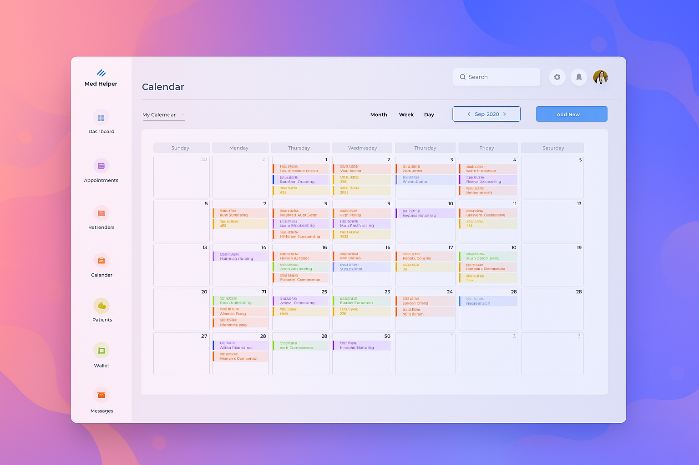
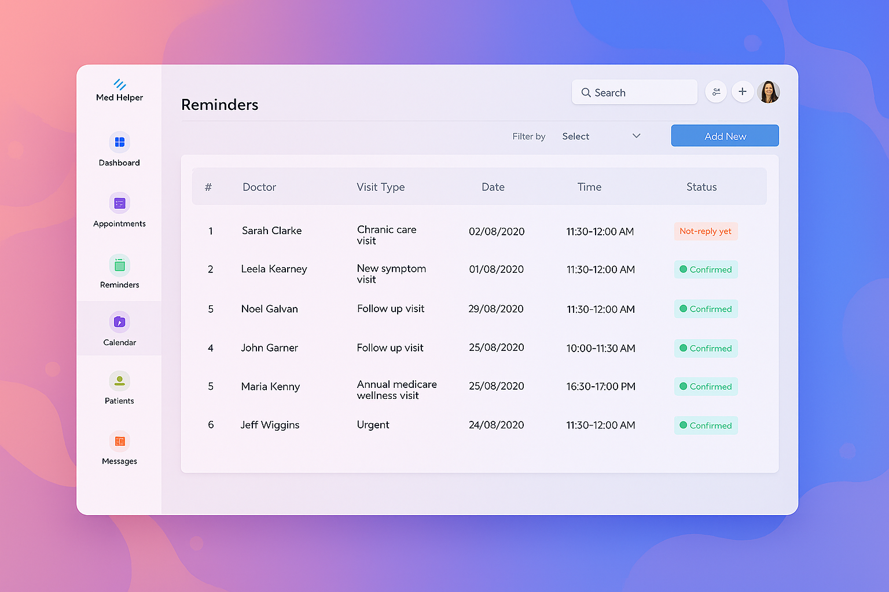

# 🩺 Doctor’s Desktop Application – Built with .NET MAUI

This project was built for a **Fiverr client** who requested a polished and modern **desktop application for doctors**, using **.NET MAUI** with a strong focus on clean UI/UX and a functional calendar system.

---

## ✅ Project Summary

This app was designed and implemented as a **Windows desktop application** using **.NET MAUI**, combining a beautiful user interface with solid local data storage and native Windows features like notifications.

We delivered:
- A complete UI overhaul across all pages
- A fully functional calendar page with patient-based appointment scheduling
- Windows toast notifications for upcoming events
- Local data persistence via **SQLite**

> 🎯 **Goal:** Deliver a responsive, modern, and intuitive interface that meets medical professional workflow needs — with smart scheduling and data management capabilities.

---

## ✨ Key Features

### 🖌️ UI/UX Design (All Pages)
- Modern, clean, and responsive layout
- Consistent styling with white (`#FFFFFF`) and cyan (`#4DD0E1`) color palette
- Smooth rounded edges and intuitive design language
- Based on client reference designs, tailored for practicality

### 📅 Calendar Page Functionality
- Integrated, always-visible calendar UI
- Ability to **Add**, **Edit**, and **Delete** appointments directly in the calendar
- Filtered appointment list tied to patients stored in the local database
- **Day / Week toggle** for calendar view configuration
- Custom **notification alerts** using native **Windows Notifications**
- All calendar data is stored locally via **SQLite**

---

## ⚙️ Technologies Used

- [.NET MAUI](https://learn.microsoft.com/en-us/dotnet/maui/) for cross-platform desktop development
- **SQLite** for local database storage
- **Windows Notifications API** for native toast alerts
- **XAML + C#** for MVVM-driven UI design and logic

---

## 💼 Project Status

This project has been **successfully delivered to the Fiverr client** and is now listed as part of our portfolio.  
We are proud to have completed all features as requested, and helped enhance the client’s application both visually and functionally.

---

## 📁 Screenshots

| Dashboard | Calendar |
|----------|----------|
|  |  |

---

> 🔒 This repository is for portfolio purposes only. Contributions, issues, and feature requests are currently not accepted.

---

## 🙋‍♂️ About the Developer

I'm Ilija — a professional .NET MAUI and cross-platform app developer with 6+ years of experience.  
I help clients build beautiful and functional apps that solve real business problems.  
[See more of my work →](https://fiverr.com/your-profile)

